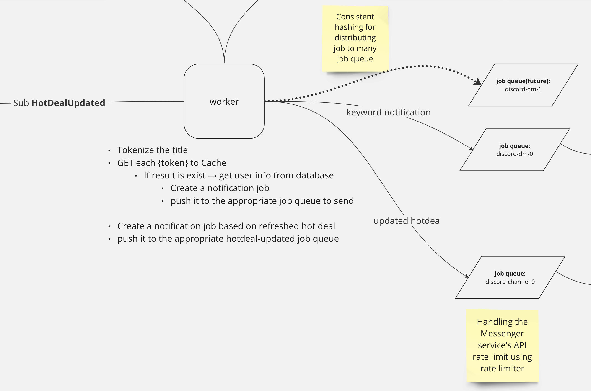

# TIL: 2023-09-01

---

# Hands on for scaling-out

- These day, I felt scaling out is required for my hot deal notification service.
- So I studied scaling out in [this repository](https://github.com/prravda/hands-on-scaling-out)
  
- This is my architecture diagram, focused on worker which detecting whether keywords exist or not in the hot deal title and creating notification jobs.
- But I thought handling should be faster if more hot deals came in.
- So I considered scaling out.

# Scaling out using message broker

- I used [`memphis`](https://memphis.dev/) for message broker and I wonder how can I distribute the message consuming for scaling out scenario.
- And I figured out if multiple consumers are located in same consumer group the message broker distribute the messages although they have same consumer name after `v1.1.1` like `kafka`.
- Then I wonder 'how message broker distribute the messages to multiple consumers in the same consumer group'.

# Learning-by-doing

- Before watching under the hood, I implemented `docker-compose.yaml` file and applications (one producer and scaled out multiple consumers) [like this](https://github.com/prravda/hands-on-scaling-out#start-application-publisher-and-multiple-subscribers).
- While doing it, I also implemented scaling out the http web application server and load-balance them using web server (nginx) [like this](https://github.com/prravda/hands-on-scaling-out#result-1).

# Next?

- I will find out how message broker distribute messages to multiple consumers in the same consumer gruop.
- Some professional senior engineers told me to learn this topics, focused on kafka.
  - what is `topic` and `partition` of message broker?
  - how consumers are allocated into the topic/partition?
  - how kafka rebalance the consumers in consumer group?
    - dynamic
    - static
    - cooperative
