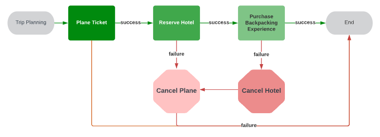

# TIL: 2023-09-08

---

# Topic

- handling multiple event sequentially

---

# Background

Today I considered a scenario. If a new hot deal came in via message broker, How can I detect the title of it contains keywords which users enrolled or not.

I handled this case using `indexOf` method of JavaScript after getting all keywords from `Redis` using `KEYS(*)` which could make a system stop.

So I tried to using a tokenizer. First, deploy the tokenizer container with HTTP server library like `FastAPI` then request with the title and got a response with tokens of them. After getting the response, send queries to Redis with the tokens as keys.

But I thought if I can handling this to make another event like `HotDealTitleTokenized`, not sending HTTP request directly to the tokenizer container(s). But to do this, the sequence of events should be assured. Becasue tokenizing the title of hot deal could be after got a new hot deal.

# What I learned

[SAGA pattern](https://dev.to/temporalio/saga-pattern-made-easy-4j42), but only the concept of it.

If one transaction became multiple transactions in microservice architecture, and engineer wanted to control the sequence, the SAGA pattern could resolve this issue. If a part of transaction is failed, then roll-back the progress using compensating transaction(or action, whatever).

But it is little bit hard to understand for me now...
